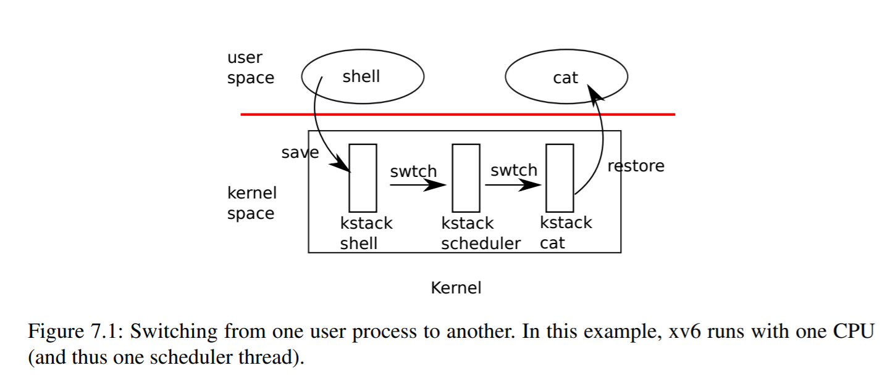

This repo contains all my codes and bugs I encountered during my work on mit6.s081. You can switch to different branches to get the solution.

Thank Robert Morris and all my friends who helped me debug and encourage me to continue.

- [x] Lab1 Xv6 and Unix utilities
- [x] Lab2 
- [x] Lab3
- [x] Lab4
- [x] Lab5
- [x] Lab6
- [x] Lab7
- [x] Lab8
- [x] Lab9
- [x] Lab10
- [x] Lab11


## Lab1 Xv6 and Unix utilities


### sleep (easy)

---
Implement the UNIX program sleep for xv6; your sleep should pause for a user-specified number of ticks. A tick is a notion of time defined by the xv6 kernel, namely the time between two interrupts from the timer chip. Your solution should be in the file `user/sleep.c`.

---

* Obtain the command-line arguments passed to a program.


> Once I wonder why we need to obtain the command-line arguments in such a tedious way. At that time I thought all arguments are passed by stack, so we can just get them from the stack but when I look at the book I found that xv6 pass most arguments by register so a syscall cause the user application to enter the kernel but this procedure will overwrite the registers so when in kernel space we need to extract the arguments from the trapframe where all the registers are stored.

* Design user interface to call `sys_sleep`

```C
+#include "kernel/types.h"
+#include "kernel/stat.h"
+#include "user/user.h"
+
+void help(){
+    printf("Usage : sleep [ cnt ]\n");
+}
+
+int
+main(int argc, char *argv[])
+{
+  if(argc != 2){
+      help();
+      exit(0);
+  }
+  int cnt;
+  cnt = atoi(argv[1]);
+  sleep(cnt);
+  exit(0);
+}
```
> At this point you may wonder how can we design a syscall in xv6. From the `usys.pl` script, and `syscall.c` file, we can know that we use ecall instruction to sink into the kernel and distinguish syscalls by a7 register which stores the syscall number. So we need to declare a user syscall stub in  `usys.pl` in order to replace all these stubs such as sleep exit by assembly language inserted to the C files.

* Add your sleep program to UPROGS in Makefile; 

```C
+	$U/_sleep\
```


## pingpong (easy)

---

Write a program that uses UNIX system calls to ''ping-pong'' a byte between two processes over a pair of pipes, one for each direction. The parent should send a byte to the child; the child should print "<pid>: received ping", where <pid> is its process ID, write the byte on the pipe to the parent, and exit; the parent should read the byte from the child, print "<pid>: received pong", and exit. Your solution should be in the file `user/pingpong.c`.

---

> When writing this function the question puzzled me most is that How can I order the output in that order that child proccess output first and the parent later on. At last I found that the read call will lock the process if the write end doesn't write anything and not close yet.

```C
+#include "kernel/types.h"
+#include "kernel/stat.h"
+#include "user/user.h"
+
+int
+main(int argc, char *argv[])
+{
+    int p[2];
+    char buf[10];
+    pipe(p);
+    int pid;
+    pid = fork();
+    if(pid<0){
+        printf("error\n");
+        exit(0);
+    }else if(pid == 0){
+        read(p[0],buf,sizeof(buf));
+        printf("%d: received %s\n",getpid(),buf);
+        write(p[1],"pong",5);
+        close(p[0]);
+        close(p[1]);
+        exit(0);
+    }else{
+        write(p[1],"ping",5);
+        wait(0);
+        read(p[0],buf,sizeof(buf));
+        printf("%d: received %s\n",getpid(),buf);
+        close(p[0]);
+        close(p[1]);
+    }
+    exit(0);
+}

```

### primes (moderate)/(hard)

---
Write a concurrent version of prime sieve using pipes. This idea is due to Doug McIlroy, inventor of Unix pipes. The picture halfway down [this page](https://swtch.com/~rsc/thread/) and the surrounding text explain how to do it. Your solution should be in the file `user/primes.c`.

Your goal is to use pipe and fork to set up the pipeline. The first process feeds the numbers 2 through 35 into the pipeline. For each prime number, you will arrange to create one process that reads from its left neighbor over a pipe and writes to its right neighbor over another pipe. Since xv6 has limited number of file descriptors and processes, the first process can stop at 35.

---

```C
+#include "kernel/types.h"
+#include "kernel/stat.h"
+#include "user/user.h"
+
+int min = 2; 
+int
+main(int argc, char *argv[])
+{
+    int _pipe[2][2];
+    pipe(_pipe[0]);
+    int index = 0;
+    int num;
+    for(int i=min;i<35;++i){
+        write(_pipe[index][1],&i,4);
+    }
+    close(_pipe[0][1]);
+    while(fork()==0){
+        if(read(_pipe[index][0],&min,4)!=0){
+            printf("prime %d\n",min);
+        }else{
+            exit(0);
+        }
+        pipe(_pipe[index^1]);
+        while(read(_pipe[index][0],&num,4)!=0){
+            if(num%min){
+                write(_pipe[index^1][1],&num,4);
+            }
+        }
+        close(_pipe[index^1][1]);
+        index = index^1;
+    }
+    close(_pipe[index][0]);
+    wait(0);
+    exit(0);
+}
```


### find (moderate) + Support regular expressions in name matching

---
Write a simple version of the UNIX find program: find all the files in a directory tree with a specific name. Your solution should be in the file user/find.c.

---


> Very direct. So I just want to point out that my ismatch function is very nice and enjoy it~


```C
+#include "kernel/types.h"
+#include "kernel/stat.h"
+#include "user/user.h"
+#include "kernel/fs.h"
+
+int ismatch(char*s,char*p){
+  int advance = 1 ;//advance p
+  if(*p == 0)
+    return *s == 0;
+  if(*p && *(p+1) && *(p+1)=='*'){
+    if(ismatch(s,p+2))
+      return 1;
+    advance = 0;
+  }
+  if((*s&&*p=='.')||*s==*p)
+    return ismatch(s+1,p+advance);
+  return 0;
+}
+
+
+char buf[512];
+char*
+fmtname(char *path)
+{
+  static char buf[DIRSIZ+1];
+  char *p;
+
+  // Find first character after last slash.
+  for(p=path+strlen(path); p >= path && *p != '/'; p--)
+    ;
+  p++;
+
+  // Return blank-padded name.
+  if(strlen(p) >= DIRSIZ)
+    return p;
+  memmove(buf, p, strlen(p));
+  memset(buf+strlen(p), '\0', DIRSIZ-strlen(p));
+  return buf;
+}
+
+void
+find(char *path,char*name)
+{
+  char *p;
+  int fd;
+  struct dirent de;
+  struct stat st;
+
+  if((fd = open(path, 0)) < 0){
+    fprintf(2, "ls: cannot open %s\n", path);
+    return;
+  }
+
+  if(fstat(fd, &st) < 0){
+    fprintf(2, "ls: cannot stat %s\n", path);
+    close(fd);
+    return;
+  }
+
+  switch(st.type){
+  case T_FILE:
+    if(ismatch(fmtname(path),name)!=0){
+        printf("%s\n",path);
+    }
+    break;
+
+  case T_DIR:
+    if(strlen(path) + 1 + DIRSIZ + 1 > sizeof buf){
+      printf("ls: path too long\n");
+      break;
+    }
+    strcpy(buf, path);
+    p = buf+strlen(buf);
+    *p++ = '/';
+    while(read(fd, &de, sizeof(de)) == sizeof(de)){
+      if(de.inum == 0 || strcmp(de.name,".")==0 || strcmp(de.name,"..")==0)
+        continue;
+      memmove(p, de.name, DIRSIZ);
+      p[DIRSIZ] = 0;
+      find(buf,name);
+    }
+    break;
+  }
+  close(fd);
+}
+
+int
+main(int argc, char *argv[])
+{
+  find(argv[1],argv[2]);
+
+  exit(0);
+}

```


### xargs (moderate)


---
Write a simple version of the UNIX xargs program: read lines from the standard input and run a command for each line, supplying the line as arguments to the command. Your solution should be in the file user/xargs.c.

---

> When I write this function I have nothing about xargs because I have never used it before. So I look up on the Internet and found that it just use the former command outputs as the input for the next command and the input is seperated by `\n` or blankspace

```C
+#include "kernel/types.h"
+#include "kernel/stat.h"
+#include "user/user.h"
+#include "kernel/fs.h"
+#include "kernel/param.h"
+
+int
+main(int argc, char *argv[]){
+    int index = 0;
+    int _argc = 1;
+    char *_argv[MAXARG];
+    if(strcmp(argv[1],"-n")==0){
+        index = 3;
+    }else{
+        index = 1;
+    }
+     _argv[0] = malloc(strlen(argv[index])+1);
+    strcpy(_argv[0],argv[index]);
+    for(int i=index+1;i<argc;++i){
+        //printf("--%s--\n",argv[i]);
+        _argv[_argc] = malloc(strlen(argv[i])+1);
+        strcpy(_argv[_argc++],argv[i]);
+    }
+    _argv[_argc] = malloc(128);
+
+    char buf;
+    int i =0;
+    while(read(0,&buf,1)){
+        if(buf=='\n'){
+            _argv[_argc][i++]='\0';
+            if(fork()==0){
+                exec(argv[index],_argv);
+            }else{
+                i=0;
+                wait(0);
+            }
+        }else{
+            _argv[_argc][i++]=buf;
+        }
+    }
+    exit(0);
+}
+

```


## Lab2 system calls

### System call tracing (moderate)

---
In this assignment you will add a system call tracing feature that may help you when debugging later labs. You'll create a new trace system call that will control tracing. It should take one argument, an integer "mask", whose bits specify which system calls to trace. For example, to trace the fork system call, a program calls trace(1 << SYS_fork), where SYS_fork is a syscall number from kernel/syscall.h. You have to modify the xv6 kernel to print out a line when each system call is about to return, if the system call's number is set in the mask. The line should contain the process id, the name of the system call and the return value; you don't need to print the system call arguments. The trace system call should enable tracing for the process that calls it and any children that it subsequently forks, but should not affect other processes.

---

> since the procedure of systemcall is `ecall` -> `trampoline` -> `usertrap()` -> `syscall()` so we 
add a stub to `usys.pl` and system number to `syscall.h` and add a field in proc to store the mask passed by the user. Then modify `syscall()` to print the message.

```diff
diff --git a/kernel/proc.h b/kernel/proc.h
index 9c16ea7..c5d61cf 100644
--- a/kernel/proc.h
+++ b/kernel/proc.h
@@ -103,4 +103,5 @@ struct proc {
   struct file *ofile[NOFILE];  // Open files
   struct inode *cwd;           // Current directory
   char name[16];               // Process name (debugging)
+  int mask;
 };
diff --git a/kernel/syscall.c b/kernel/syscall.c
index c1b3670..ee25ccd 100644
--- a/kernel/syscall.c
+++ b/kernel/syscall.c
@@ -104,6 +104,8 @@ extern uint64 sys_unlink(void);
 extern uint64 sys_wait(void);
 extern uint64 sys_write(void);
 extern uint64 sys_uptime(void);
+extern uint64 sys_trace(void);
+extern uint64 sys_sysinfo(void);
 
 static uint64 (*syscalls[])(void) = {
 [SYS_fork]    sys_fork,
@@ -127,8 +129,13 @@ static uint64 (*syscalls[])(void) = {
 [SYS_link]    sys_link,
 [SYS_mkdir]   sys_mkdir,
 [SYS_close]   sys_close,
+[SYS_trace]   sys_trace,
+[SYS_sysinfo]   sys_sysinfo,
 };
 
+
+
+static char *syscall_name[]={"","fork","exit","wait","pipe","read","kill","exec","fstat","chdir","dup","getpid","sbrk","sleep","uptime","open","write","mknod","unlink","link","mkdir","close","trace","sysinfo"};
 void
 syscall(void)
 {
@@ -138,6 +145,9 @@ syscall(void)
   num = p->trapframe->a7;
   if(num > 0 && num < NELEM(syscalls) && syscalls[num]) {
     p->trapframe->a0 = syscalls[num]();
+    if((p->mask>>num)&1){
+      printf("%d: syscall %s -> %d\n",p->pid,syscall_name[num],p->trapframe->a0);
+    }
   } else {
     printf("%d %s: unknown sys call %d\n",
             p->pid, p->name, num);
diff --git a/kernel/syscall.h b/kernel/syscall.h
index bc5f356..e153363 100644
--- a/kernel/syscall.h
+++ b/kernel/syscall.h
@@ -20,3 +20,5 @@
 #define SYS_link   19
 #define SYS_mkdir  20
 #define SYS_close  21
+#define SYS_trace  22
+#define SYS_sysinfo 23
\ No newline at end of file
diff --git a/kernel/sysfile.c b/kernel/sysfile.c
index 5dc453b..ceb7615 100644
--- a/kernel/sysfile.c
+++ b/kernel/sysfile.c
@@ -484,3 +484,5 @@ sys_pipe(void)
   }
   return 0;
 }
+
+
diff --git a/kernel/sysproc.c b/kernel/sysproc.c
index e8bcda9..c614de3 100644
--- a/kernel/sysproc.c
+++ b/kernel/sysproc.c
@@ -6,6 +6,7 @@
 #include "memlayout.h"
 #include "spinlock.h"
 #include "proc.h"
+#include "sysinfo.h"
 
 uint64
 sys_exit(void)
@@ -95,3 +96,28 @@ sys_uptime(void)
   release(&tickslock);
   return xticks;
 }
+
+uint64
+sys_trace(void){
+  int n;
+  if(argint(0, &n) < 0)
+    return -1;
+  myproc()->mask = n;
+  return 0;
+}
+

```


### Sysinfo (moderate)

---
In this assignment you will add a system call, sysinfo, that collects information about the running system. The system call takes one argument: a pointer to a struct sysinfo (see kernel/sysinfo.h). The kernel should fill out the fields of this struct: the freemem field should be set to the number of bytes of free memory, and the nproc field should be set to the number of processes whose state is not UNUSED. We provide a test program sysinfotest; you pass this assignment if it prints "sysinfotest: OK".

---

> Add `$U/_sysinfotest` to UPROGS in Makefile and then add prototype. 

```diff
diff --git a/kernel/kalloc.c b/kernel/kalloc.c
index fa6a0ac..8d2af42 100644
--- a/kernel/kalloc.c
+++ b/kernel/kalloc.c
@@ -80,3 +80,17 @@ kalloc(void)
     memset((char*)r, 5, PGSIZE); // fill with junk
   return (void*)r;
 }
+
+
+uint64 cal_freemem(){
+  struct run *r;
+  uint64 freemem=0;
+  r = kmem.freelist;
+  acquire(&kmem.lock);
+  while(r){
+    freemem += PGSIZE;
+    r = r->next;
+  }
+  release(&kmem.lock);
+  return freemem;
+}
\ No newline at end of file
diff --git a/kernel/proc.c b/kernel/proc.c
index 6afafa1..93447a8 100644
--- a/kernel/proc.c
+++ b/kernel/proc.c
@@ -277,6 +277,7 @@ fork(void)
 
   np->parent = p;
 
+  np->mask = p->mask;
   // copy saved user registers.
   *(np->trapframe) = *(p->trapframe);
 
@@ -693,3 +694,18 @@ procdump(void)
     printf("\n");
   }
 }
+
+
+
+uint64 cal_nproc(){
+  uint64 nproc=0;
+  struct proc *p;
+  for(p = proc; p < &proc[NPROC]; p++) {
+    acquire(&p->lock);
+    if(p->state != UNUSED) {
+      nproc++;
+    }
+    release(&p->lock);
+  }
+  return nproc;
+}

+
+uint64
+sys_sysinfo(void){
+
+  struct sysinfo kinfo;
+  uint64 info;
+  if(argaddr(0,&info)<0)
+    return -1;
+  kinfo.freemem = cal_freemem();
+  kinfo.nproc = cal_nproc();
+  if(copyout(myproc()->pagetable,(uint64)info,(char*)&kinfo,sizeof(struct sysinfo))<0){
+    return -1;
+  }
+  return 0;
+}
\ No newline at end of file
diff --git a/time.txt b/time.txt
new file mode 100644
index 0000000..7813681
--- /dev/null
+++ b/time.txt
@@ -0,0 +1 @@
+5
\ No newline at end of file
diff --git a/user/sysinfotest.c b/user/sysinfotest.c
index 254f6d2..079daf9 100644
--- a/user/sysinfotest.c
+++ b/user/sysinfotest.c
@@ -99,6 +99,7 @@ void testproc() {
   sinfo(&info);
   nproc = info.nproc;
 
+  
   pid = fork();
   if(pid < 0){
     printf("sysinfotest: fork failed\n");
diff --git a/user/user.h b/user/user.h
index b71ecda..6c825c6 100644
--- a/user/user.h
+++ b/user/user.h
@@ -23,6 +23,10 @@ int getpid(void);
 char* sbrk(int);
 int sleep(int);
 int uptime(void);
+int trace(int);
+struct sysinfo;
+int sysinfo(struct sysinfo*);
+
 
 // ulib.c
 int stat(const char*, struct stat*);
diff --git a/user/usys.pl b/user/usys.pl
index 01e426e..bc109fd 100755
--- a/user/usys.pl
+++ b/user/usys.pl
@@ -36,3 +36,5 @@ entry("getpid");
 entry("sbrk");
 entry("sleep");
 entry("uptime");
+entry("trace");
+entry("sysinfo");


```
 

---
为什么从内核态到用户态需要用到copyout？ 

---
> 因为内核态的页表和用户态的不是一样的，用户态页表和内核态的都需要进行映射，而用户态传过来的地址全部都是虚拟地址，所以需要手动转化为物理地址，再copy。

---
为什么我们在系统调用中需要那么麻烦的将传递的参数用很多函数比如argaddr中取出来呢？

---
> 因为在系统调用的整个过程，会存在很多的指令，所以我们先把从用户态传递过来的参数保存到trapframe里面去，因为如果不保存的话寄存器会被覆盖掉，而参数的传递一般在a0-a5寄存器中。


## Lab4 Trap

### Backtrace

* Add the prototype for backtrace to `kernel/defs.h`

```C
+void            backtrace();
```

*  Add the following function to `kernel/riscv.h`

```
+
+static inline uint64
+r_fp()
+{
+  uint64 x;
+  asm volatile("mv %0, s0" : "=r" (x) );
+  return x;
+}
+
```


* design backtrace function


since the stack grows to the lower address,so the stack bottom can be calculated by `PGROUNDUP(fp)` and by the xv6 memory layout we can know that  the return address lives at a fixed offset (-8) from the frame pointer of a stackframe, and that the saved frame pointer lives at fixed offset (-16) from the frame pointer.


```C
+
+void backtrace(){
+  printf("backtrace:\n");
+  uint64 fp = r_fp();
+  uint64 stack_bottom = PGROUNDUP(fp);
+  while(fp<stack_bottom){
+    //printf("fp : %p\n",fp);
+    uint64 return_address = *(uint64*)(fp-8);
+    printf("%p\n",return_address);
+    fp = *(uint64*)(fp-16);
+  }
+}

```

* add `backtrace` to `sys_sleep`

```C
+  backtrace();
```


### Alarm (hard)

* add `alarmtest.c` to `Makefile`

* add two syscall `sigalarm` and `sigreturn`
    * `syscall.c`

    ```C
    +extern uint64 sys_sigalarm(void);
    +extern uint64 sys_sigreturn(void);
    +
    +
    +[SYS_sigalarm]   sys_sigalarm,
    +[SYS_sigreturn]   sys_sigreturn,
    ```

    * `syscall.h`
    ```C
    +#define SYS_sigalarm  22
    +#define SYS_sigreturn  23
    ```
    * `user.h`
    ```C
    +int sigalarm(int ticks, void (*handler)());
    +int sigreturn(void);
    ```

    * `usys.pl`
    ```
    +entry("sigreturn");
    +entry("sigalarm"); 
    ```

* add new fields to `proc` structure
```
+  int is_sigalarm;
+  int ticks;
+  int now_ticks;
+  uint64 handler;
+  struct trapframe *trapframe_copy;
```

Why we need these new variables?

Since we need to mark how many ticks have passed we declare `now_ticks` adn we use `kicks` to store the value passed by syscall and we use `hanlder` to store the handler function address. The most hard part to understand is why we need a new `trapframe` structure. I think we can think this way, once the handler function has expired time interupt can still occur and in this way we store the variables at that time(when executing the handler function), so the variables we store to trapframe when we first expire the handler function are overwritten so we need a new trapframe to store the registers when first expire handler function.

* initilize the variables and withdraw them.
    * `proc.c`
    ```C
    allocproc:
    +  if((p->trapframe_copy = (struct trapframe *)kalloc()) == 0){
    +    release(&p->lock);
    +    return 0;
    +  }

    +  p->is_sigalarm=0;
    +  p->ticks=0;
    +  p->now_ticks=0;
    +  p->handler=0;


    freeproc:
    +  if(p->trapframe_copy)
    +    kfree((void*)p->trapframe_copy);
   p->trapframe = 0;

    +uint64 sys_sigalarm(void){
    +  int ticks;
    +  if(argint(0, &ticks) < 0)
    +    return -1;
    +  uint64 handler;
    +  if(argaddr(1, &handler) < 0)
    +    return -1;
    +  myproc()->is_sigalarm =0;
    +  myproc()->ticks = ticks;
    +  myproc()->now_ticks = 0;
    +  myproc()->handler = handler;
    +  return 0; 
    ```

    * 


*  if the process has a timer outstanding then expire the handler function.
    * trap.c
    ```C
    -  if(which_dev == 2)
    -    yield();
    +  if(which_dev == 2){
    +    p->now_ticks+=1;
    +    if(p->ticks>0&&p->now_ticks>=p->ticks&&!p->is_sigalarm){
    +      p->now_ticks = 0;
    +      p->is_sigalarm=1;
    +      *(p->trapframe_copy)=*(p->trapframe);
    +      p->trapframe->epc=p->handler;
    +    }
    +  yield();
    +  }

    ```

* design the return function

    * `sysproc.c`
    ```C
    +
    +void restore(){
    +  struct proc*p=myproc();
    +
    +  p->trapframe_copy->kernel_satp = p->trapframe->kernel_satp;
    +  p->trapframe_copy->kernel_sp = p->trapframe->kernel_sp;
    +  p->trapframe_copy->kernel_trap = p->trapframe->kernel_trap;
    +  p->trapframe_copy->kernel_hartid = p->trapframe->kernel_hartid;
    +  *(p->trapframe) = *(p->trapframe_copy);
    +}
    +
    +uint64 sys_sigreturn(void){
    +  restore();
    +  myproc()->is_sigalarm = 0;
    +  return 0;
    +}
    +
    +
    ```
we shouldn't directly restore all variables to traframe because all kernel stack and something other are used for public(becuase if we restore kernel stack we may encounter error).


## Lab6 Copy-on-Write Fork for xv6

### Implement copy-on write(hard)

---
Your task is to implement copy-on-write fork in the xv6 kernel. You are done if your modified kernel executes both the cowtest and usertests programs successfully.

---

* Modify uvmcopy() to map the parent's physical pages into the child, instead of allocating new pages. Clear PTE_W in the PTEs of both child and parent. 

---
That's to say, we need to make those pages of parents which is marked as writable unwritable and use a new bit to mark them as `COW` page. By doing so we can share readable pages between parents and children and when need to write on `COW` pages we allocate new pages.

---

```C
-  char *mem;
 
   for(i = 0; i < sz; i += PGSIZE){
     if((pte = walk(old, i, 0)) == 0)
@@ -320,18 +320,26 @@ uvmcopy(pagetable_t old, pagetable_t new, uint64 sz)
       panic("uvmcopy: page not present");
     pa = PTE2PA(*pte);
     flags = PTE_FLAGS(*pte);
-    if((mem = kalloc()) == 0)
-      goto err;
-    memmove(mem, (char*)pa, PGSIZE);
-    if(mappages(new, i, PGSIZE, (uint64)mem, flags) != 0){
-      kfree(mem);
+    if(flags&PTE_W){
+      flags = (flags&(~PTE_W))|PTE_C;
+      *pte = PA2PTE(pa)|flags;
+    }
+    if(mappages(new, i, PGSIZE, pa, flags) != 0){
       goto err;
     }
+    inc_page_ref((void*)pa);
+    // if((mem = kalloc()) == 0)
+    //   goto err;
+    // memmove(mem, (char*)pa, PGSIZE);
+    // if(mappages(new, i, PGSIZE, (uint64)mem, flags) != 0){
+    //   kfree(mem);
+    //   goto err;
+    // }

```

* Modify usertrap() to recognize page faults. When a page-fault occurs on a COW page, allocate a new page with kalloc(), copy the old page to the new page, and install the new page in the PTE with PTE_W set.

---
Note, this only cares the current process so we just allocate a page for the cow page and map the new page to the pagetable. We need call  `kfree()` to free the previous page which is a cow page if no process owns it.

---


```C
-void
+// -1 means cannot alloc mem
+// -2 means the address is invalid
+// 0 means ok
+int page_fault_handler(void*va,pagetable_t pagetable){
+ 
+  struct proc* p = myproc();
+  if((uint64)va>=MAXVA||((uint64)va>=PGROUNDDOWN(p->trapframe->sp)-PGSIZE&&(uint64)va<=PGROUNDDOWN(p->trapframe->sp))){
+    return -2;
+  }
+
+  pte_t *pte;
+  uint64 pa;
+  uint flags;
+  va = (void*)PGROUNDDOWN((uint64)va);
+  pte = walk(pagetable,(uint64)va,0);
+  if(pte == 0){
+    return -1;
+  }
+  pa = PTE2PA(*pte);
+  if(pa == 0){
+    return -1;
+  }
+  flags = PTE_FLAGS(*pte);
+  if(flags&PTE_C){
+    flags = (flags|PTE_W)&(~PTE_C);
+    char*mem;
+    mem = kalloc();
+    if(mem==0){
+      return -1;
+    }
+    memmove(mem,(void*)pa,PGSIZE); 
+    *pte = PA2PTE(mem)|flags;
+    kfree((void*)pa);
+    return 0;
+  }
+  return 0;
+}
+
+
+void 
 trapinit(void)
 {
   initlock(&tickslock, "time");
@@ -67,7 +106,12 @@ usertrap(void)
     syscall();
   } else if((which_dev = devintr()) != 0){
     // ok
-  } else {
+  }else if(r_scause()==15||r_scause()==13){
+    int res = page_fault_handler((void*)r_stval(),p->pagetable);
+    if(res == -1 || res==-2){
+      p->killed=1;
+    }
+  }else {
     printf("usertrap(): unexpected scause %p pid=%d\n", r_scause(), p->pid);
     printf("            sepc=%p stval=%p\n", r_sepc(), r_stval());
     p->killed = 1;

```

* Ensure that each physical page is freed when the last PTE reference to it goes away -- but not before. A good way to do this is to keep, for each physical page, a "reference count" of the number of user page tables that refer to that page. Set a page's reference count to one when kalloc() allocates it. Increment a page's reference count when fork causes a child to share the page, and decrement a page's count each time any process drops the page from its page table. kfree() should only place a page back on the free list if its reference count is zero. It's OK to to keep these counts in a fixed-size array of integers. You'll have to work out a scheme for how to index the array and how to choose its size. For example, you could index the array with the page's physical address divided by 4096, and give the array a number of elements equal to highest physical address of any page placed on the free list by kinit() in kalloc.c.


```C
+struct {
+  struct spinlock lock;
+  int count[PGROUNDUP(PHYSTOP)>>12];
+} page_ref;
+
+void init_page_ref(){
+  initlock(&page_ref.lock, "page_ref");
+  acquire(&page_ref.lock);
+  for(int i=0;i<(PGROUNDUP(PHYSTOP)>>12);++i)
+    page_ref.count[i]=0;
+  release(&page_ref.lock);
+}
+
+
+void dec_page_ref(void*pa){
+  acquire(&page_ref.lock);
+  if(page_ref.count[(uint64)pa>>12]<=0){
+    panic("dec_page_ref");
+  }
+  page_ref.count[(uint64)pa>>12]-=1;
+  release(&page_ref.lock);
+}
+
+void inc_page_ref(void*pa){
+  acquire(&page_ref.lock);
+  if(page_ref.count[(uint64)pa>>12]<0){
+    panic("inc_page_ref");
+  }
+  page_ref.count[(uint64)pa>>12]+=1;
+  release(&page_ref.lock);
+}
+
+int get_page_ref(void*pa){
+  acquire(&page_ref.lock);
+  int res = page_ref.count[(uint64)pa>>12];
+  if(page_ref.count[(uint64)pa>>12]<0){
+    panic("get_page_ref");
+  }
+  release(&page_ref.lock);
+  return res;
+}
+
+
 void
 kinit()
 {
+  init_page_ref();
   initlock(&kmem.lock, "kmem");
   freerange(end, (void*)PHYSTOP);
 }
@@ -35,8 +79,10 @@ freerange(void *pa_start, void *pa_end)
 {
   char *p;
   p = (char*)PGROUNDUP((uint64)pa_start);
-  for(; p + PGSIZE <= (char*)pa_end; p += PGSIZE)
+  for(; p + PGSIZE <= (char*)pa_end; p += PGSIZE){
+    inc_page_ref(p);
     kfree(p);
+  }
 }
 
 // Free the page of physical memory pointed at by v,
@@ -47,10 +93,18 @@ void
 kfree(void *pa)
 {
   struct run *r;
-
   if(((uint64)pa % PGSIZE) != 0 || (char*)pa < end || (uint64)pa >= PHYSTOP)
     panic("kfree");
-
+  acquire(&page_ref.lock);
+  if(page_ref.count[(uint64)pa>>12]<=0){
+    panic("dec_page_ref");
+  }
+  page_ref.count[(uint64)pa>>12]-=1;
+  if(page_ref.count[(uint64)pa>>12]>0){
+    release(&page_ref.lock);
+    return;
+  }
+  release(&page_ref.lock);
   // Fill with junk to catch dangling refs.
   memset(pa, 1, PGSIZE);
 
@@ -76,7 +130,9 @@ kalloc(void)
     kmem.freelist = r->next;
   release(&kmem.lock);
 
-  if(r)
+  if(r){
     memset((char*)r, 5, PGSIZE); // fill with junk
+    inc_page_ref((void*)r);
+  }
   return (void*)r;
 }

```

At this point, I have made many mistakes such as:

* forget to increase the ref_count in `freerange()` since `freerange()` will call `kfree()` and `free()` will decrease the count so we need to first increase then  decrease.
* I first write a version `kfree()` as follow:
    ```C
    dec_page_ref(pa);
    if(get_page_ref(pa)>0){
        return ;
    }
    ```
this can cause many mistakes because there is a gap between the two call `dec_page_ref()` and `get_page_ref()` so if two process call `kfree()` to free the COW page but the procedure can be like this: a.dec,b.dec,b.get,b.get so this may cause the page to repeate inserting to the list.

* Modify copyout() to use the same scheme as page faults when it encounters a COW page.

```C
copyout(pagetable_t pagetable, uint64 dstva, char *src, uint64 len)
 {
-  uint64 n, va0, pa0;
-
+  uint64 n, va0, pa0,flags;
+  pte_t *pte;
   while(len > 0){
     va0 = PGROUNDDOWN(dstva);
     pa0 = walkaddr(pagetable, va0);
     if(pa0 == 0)
       return -1;
+    pte = walk(pagetable,va0,0);
+    flags=PTE_FLAGS(*pte);
+    if(flags&PTE_C){
+      page_fault_handler((void*)va0,pagetable);
+      pa0 = walkaddr(pagetable,va0);
+    }
     n = PGSIZE - (dstva - va0);
     if(n > len)
       n = len;
```


## Lab7 Multithreading

### Uthread: switching between threads (moderate)

> We just need to know that `ret` will cause the value of pc register to be the same as ra. And the stack goes to the low address. So when we create a new process we need to initilize the sp to the highest address of the stack.


```diff
--- a/user/uthread.c
+++ b/user/uthread.c
@@ -12,6 +12,22 @@
 
 
 struct thread {
+  uint64 ra;
+  uint64 sp;
+
+  // callee-saved
+  uint64 s0;
+  uint64 s1;
+  uint64 s2;
+  uint64 s3;
+  uint64 s4;
+  uint64 s5;
+  uint64 s6;
+  uint64 s7;
+  uint64 s8;
+  uint64 s9;
+  uint64 s10;
+  uint64 s11;
   char       stack[STACK_SIZE]; /* the thread's stack */
   int        state;             /* FREE, RUNNING, RUNNABLE */
 
@@ -63,6 +79,7 @@ thread_schedule(void)
      * Invoke thread_switch to switch from t to next_thread:
      * thread_switch(??, ??);
      */
+    thread_switch((uint64)t,(uint64)next_thread);
   } else
     next_thread = 0;
 }
@@ -77,6 +94,9 @@ thread_create(void (*func)())
   }
   t->state = RUNNABLE;
   // YOUR CODE HERE
+  t->ra = (uint64)func;
+  //栈是向下生长的！！！很重要
+  t->sp = (uint64)t->stack+STACK_SIZE;
 }
 
 void 
diff --git a/user/uthread_switch.S b/user/uthread_switch.S
index 5defb12..febbf9e 100644
--- a/user/uthread_switch.S
+++ b/user/uthread_switch.S
@@ -8,4 +8,34 @@
 	.globl thread_switch
 thread_switch:
 	/* YOUR CODE HERE */
-	ret    /* return to ra */
+        sd ra, 0(a0)
+        sd sp, 8(a0)
+        sd s0, 16(a0)
+        sd s1, 24(a0)
+        sd s2, 32(a0)
+        sd s3, 40(a0)
+        sd s4, 48(a0)
+        sd s5, 56(a0)
+        sd s6, 64(a0)
+        sd s7, 72(a0)
+        sd s8, 80(a0)
+        sd s9, 88(a0)
+        sd s10, 96(a0)
+        sd s11, 104(a0)
+
+        ld ra, 0(a1)
+        ld sp, 8(a1)
+        ld s0, 16(a1)
+        ld s1, 24(a1)
+        ld s2, 32(a1)
+        ld s3, 40(a1)
+        ld s4, 48(a1)
+        ld s5, 56(a1)
+        ld s6, 64(a1)
+        ld s7, 72(a1)
+        ld s8, 80(a1)
+        ld s9, 88(a1)
+        ld s10, 96(a1)
+        ld s11, 104(a1)
+        
+        ret


```


### Using threads (moderate)

> We just need know that when two thread update the bucket this will cause error. So just add lock to `insert` and `get`

```diff
diff --git a/notxv6/ph.c b/notxv6/ph.c
index 6df1500..20d283e 100644
--- a/notxv6/ph.c
+++ b/notxv6/ph.c
@@ -16,7 +16,7 @@ struct entry {
 struct entry *table[NBUCKET];
 int keys[NKEYS];
 int nthread = 1;
-
+pthread_mutex_t lock[NBUCKET];            // declare a lock
 double
 now()
 {
@@ -39,7 +39,7 @@ static
 void put(int key, int value)
 {
   int i = key % NBUCKET;
-
+  pthread_mutex_lock(&lock[i]);       // acquire lock
   // is the key already present?
   struct entry *e = 0;
   for (e = table[i]; e != 0; e = e->next) {
@@ -53,19 +53,21 @@ void put(int key, int value)
     // the new is new.
     insert(key, value, &table[i], table[i]);
   }
+  pthread_mutex_unlock(&lock[i]);     // release lock
 }
 
 static struct entry*
 get(int key)
 {
-  int i = key % NBUCKET;
 
+  int i = key % NBUCKET;
 
+  pthread_mutex_lock(&lock[i]); 
   struct entry *e = 0;
   for (e = table[i]; e != 0; e = e->next) {
     if (e->key == key) break;
   }
-
+  pthread_mutex_unlock(&lock[i]);     // release lock
   return e;
 }
 
@@ -107,10 +109,14 @@ main(int argc, char *argv[])
     fprintf(stderr, "Usage: %s nthreads\n", argv[0]);
     exit(-1);
   }
+  
   nthread = atoi(argv[1]);
   tha = malloc(sizeof(pthread_t) * nthread);
   srandom(0);
   assert(NKEYS % nthread == 0);
+  for(int i=0;i<NBUCKET;++i){
+    pthread_mutex_init(&lock[i],NULL);
+  }
   for (int i = 0; i < NKEYS; i++) {
     keys[i] = random();
   }
diff --git a/time.txt b/time.txt
new file mode 100644
index 0000000..e440e5c
--- /dev/null
+++ b/time.txt
@@ -0,0 +1 @@
+3

```


### Barrier(moderate)

> A way to know `pthread_cond_wait` and `pthread_cond_broadcast`

```diff
diff --git a/answers-thread.txt b/answers-thread.txt
new file mode 100644
index 0000000..9fe2d5e
--- /dev/null
+++ b/answers-thread.txt
@@ -0,0 +1 @@
+when multiple threads inset into the same bucket.This will cause error.
\ No newline at end of file
diff --git a/notxv6/barrier.c b/notxv6/barrier.c
index 12793e8..91525f2 100644
--- a/notxv6/barrier.c
+++ b/notxv6/barrier.c
@@ -30,7 +30,18 @@ barrier()
   // Block until all threads have called barrier() and
   // then increment bstate.round.
   //
-  
+  pthread_mutex_lock(&bstate.barrier_mutex);
+  bstate.nthread+=1;
+  if(bstate.nthread==nthread){
+    bstate.nthread=0;
+    bstate.round+=1;
+    pthread_mutex_unlock(&bstate.barrier_mutex);
+    pthread_cond_broadcast(&bstate.barrier_cond);
+    return;
+  }
+  pthread_cond_wait(&bstate.barrier_cond,&bstate.barrier_mutex);
+  pthread_mutex_unlock(&bstate.barrier_mutex);
+  return;
 }
```


## Lab8 Lock

### Memory allocator (moderate)

> very easy. No need to say much.


```diff
diff --git a/kernel/kalloc.c b/kernel/kalloc.c
index fa6a0ac..5e4ec1a 100644
--- a/kernel/kalloc.c
+++ b/kernel/kalloc.c
@@ -21,12 +21,14 @@ struct run {
 struct {
   struct spinlock lock;
   struct run *freelist;
-} kmem;
+} kmem[NCPU];
 
 void
 kinit()
 {
-  initlock(&kmem.lock, "kmem");
+  for(int i=0;i<NCPU;++i){
+    initlock(&kmem[i].lock, "kmem");
+  }
   freerange(end, (void*)PHYSTOP);
 }
 
@@ -55,11 +57,13 @@ kfree(void *pa)
   memset(pa, 1, PGSIZE);
 
   r = (struct run*)pa;
-
-  acquire(&kmem.lock);
-  r->next = kmem.freelist;
-  kmem.freelist = r;
-  release(&kmem.lock);
+  push_off();
+  int cpu_id=cpuid();
+  pop_off();
+  acquire(&kmem[cpu_id].lock);
+  r->next = kmem[cpu_id].freelist;
+  kmem[cpu_id].freelist = r;
+  release(&kmem[cpu_id].lock);
 }
 
 // Allocate one 4096-byte page of physical memory.
@@ -69,12 +73,33 @@ void *
 kalloc(void)
 {
   struct run *r;
-
-  acquire(&kmem.lock);
-  r = kmem.freelist;
-  if(r)
-    kmem.freelist = r->next;
-  release(&kmem.lock);
+  push_off();
+  int cpu_id=cpuid();
+  pop_off();
+  acquire(&kmem[cpu_id].lock);
+  r = kmem[cpu_id].freelist;
+  if(r){
+    kmem[cpu_id].freelist = r->next;
+  }else{
+    int found=0;
+    for(int i=0;i<NCPU;++i){
+      if(i==cpu_id){
+        continue;
+      }else{
+        acquire(&kmem[i].lock);
+        r = kmem[i].freelist;
+        if(r){
+          kmem[i].freelist = r->next;
+          found=1;
+        }
+        release(&kmem[i].lock);
+      }
+      if(found){
+        break;
+      }
+    }
+  }
+  release(&kmem[cpu_id].lock);
 
   if(r)
     memset((char*)r, 5, PGSIZE); // fill with junk
```


### Buffer cache (hard)
> Same as the first one avove.
```diff
diff --git a/kernel/bio.c b/kernel/bio.c
index 60d91a6..0108dd3 100644
--- a/kernel/bio.c
+++ b/kernel/bio.c
@@ -24,31 +24,32 @@
 #include "buf.h"
 
 struct {
-  struct spinlock lock;
-  struct buf buf[NBUF];
+  struct spinlock lock[BUCKETS];
+  struct buf buf[BUCKETS][BNBUF];
 
   // Linked list of all buffers, through prev/next.
   // Sorted by how recently the buffer was used.
   // head.next is most recent, head.prev is least.
-  struct buf head;
+  struct buf head[BUCKETS];
 } bcache;
 
 void
 binit(void)
 {
   struct buf *b;
-
-  initlock(&bcache.lock, "bcache");
-
-  // Create linked list of buffers
-  bcache.head.prev = &bcache.head;
-  bcache.head.next = &bcache.head;
-  for(b = bcache.buf; b < bcache.buf+NBUF; b++){
-    b->next = bcache.head.next;
-    b->prev = &bcache.head;
-    initsleeplock(&b->lock, "buffer");
-    bcache.head.next->prev = b;
-    bcache.head.next = b;
+  for(int i=0;i<BUCKETS;++i){
+    initlock(&bcache.lock[i], "bcache");
+
+    // Create linked list of buffers
+    bcache.head[i].prev = &bcache.head[i];
+    bcache.head[i].next = &bcache.head[i];
+    for(b = bcache.buf[i]; b < bcache.buf[i]+BNBUF; b++){
+      b->next = bcache.head[i].next;
+      b->prev = &bcache.head[i];
+      initsleeplock(&b->lock, "buffer");
+      bcache.head[i].next->prev = b;
+      bcache.head[i].next = b;
+    }
   }
 }
 
@@ -59,14 +60,14 @@ static struct buf*
 bget(uint dev, uint blockno)
 {
   struct buf *b;
-
-  acquire(&bcache.lock);
+  int i = blockno%BUCKETS;
+  acquire(&bcache.lock[i]);
 
   // Is the block already cached?
-  for(b = bcache.head.next; b != &bcache.head; b = b->next){
+  for(b = bcache.head[i].next; b != &bcache.head[i]; b = b->next){
     if(b->dev == dev && b->blockno == blockno){
       b->refcnt++;
-      release(&bcache.lock);
+      release(&bcache.lock[i]);
       acquiresleep(&b->lock);
       return b;
     }
@@ -74,17 +75,26 @@ bget(uint dev, uint blockno)
 
   // Not cached.
   // Recycle the least recently used (LRU) unused buffer.
-  for(b = bcache.head.prev; b != &bcache.head; b = b->prev){
+  for(b = bcache.head[i].prev; b != &bcache.head[i]; b = b->prev){
     if(b->refcnt == 0) {
       b->dev = dev;
       b->blockno = blockno;
       b->valid = 0;
       b->refcnt = 1;
-      release(&bcache.lock);
+      release(&bcache.lock[i]);
       acquiresleep(&b->lock);
       return b;
     }
   }
+  // b = bcache.head[i].prev;
+  // acquiresleep(&b->lock);
+  // bwrite(b);
+  // b->dev = dev;
+  // b->blockno = blockno;
+  // b->valid = 0;
+  // b->refcnt = 1;
+  // release(&bcache.lock[i]);
+  // return b;
   panic("bget: no buffers");
 }
 
@@ -118,36 +128,38 @@ brelse(struct buf *b)
 {
   if(!holdingsleep(&b->lock))
     panic("brelse");
-
+  int i=b->blockno%BUCKETS;
   releasesleep(&b->lock);
 
-  acquire(&bcache.lock);
+  acquire(&bcache.lock[i]);
   b->refcnt--;
   if (b->refcnt == 0) {
     // no one is waiting for it.
     b->next->prev = b->prev;
     b->prev->next = b->next;
-    b->next = bcache.head.next;
-    b->prev = &bcache.head;
-    bcache.head.next->prev = b;
-    bcache.head.next = b;
+    b->next = bcache.head[i].next;
+    b->prev = &bcache.head[i];
+    bcache.head[i].next->prev = b;
+    bcache.head[i].next = b;
   }
   
-  release(&bcache.lock);
+  release(&bcache.lock[i]);
 }
 
 void
 bpin(struct buf *b) {
-  acquire(&bcache.lock);
+  int i = b->blockno%BUCKETS;
+  acquire(&bcache.lock[i]);
   b->refcnt++;
-  release(&bcache.lock);
+  release(&bcache.lock[i]);
 }
 
 void
 bunpin(struct buf *b) {
-  acquire(&bcache.lock);
+  int i = b->blockno%BUCKETS;
+  acquire(&bcache.lock[i]);
   b->refcnt--;
-  release(&bcache.lock);
+  release(&bcache.lock[i]);
 }
 
 
diff --git a/kernel/main.c b/kernel/main.c
index 9b75ec3..72ff75c 100644
--- a/kernel/main.c
+++ b/kernel/main.c
@@ -28,6 +28,7 @@ main()
     plicinit();      // set up interrupt controller
     plicinithart();  // ask PLIC for device interrupts
     binit();         // buffer cache
+    printf("binit is ok\n");
     iinit();         // inode cache
     fileinit();      // file table
     virtio_disk_init(); // emulated hard disk
diff --git a/kernel/param.h b/kernel/param.h
index bb80c76..a298d77 100644
--- a/kernel/param.h
+++ b/kernel/param.h
@@ -11,3 +11,5 @@
 #define NBUF         (MAXOPBLOCKS*3)  // size of disk block cache
 #define FSSIZE       10000  // size of file system in blocks
 #define MAXPATH      128   // maximum file path name
+#define BUCKETS      13
+#define BNBUF        10
\ No newline at end of file


```


## Lab9

### Large files (moderate)

```diff
diff --git a/kernel/file.h b/kernel/file.h
index b076d1d..5c4eb3a 100644
--- a/kernel/file.h
+++ b/kernel/file.h
@@ -26,7 +26,7 @@ struct inode {
   short minor;
   short nlink;
   uint size;
-  uint addrs[NDIRECT+1];
+  uint addrs[NDIRECT+2];
 };
 
 // map major device number to device functions.
diff --git a/kernel/fs.c b/kernel/fs.c
index f33553a..582c88b 100644
--- a/kernel/fs.c
+++ b/kernel/fs.c
@@ -401,6 +401,28 @@ bmap(struct inode *ip, uint bn)
     return addr;
   }
 
+  bn -= NINDIRECT;
+  if(bn < DNINDIRECT){
+    if((addr = ip->addrs[DNDIRECT]) == 0)
+      ip->addrs[DNDIRECT] = addr = balloc(ip->dev);
+    bp = bread(ip->dev, addr);
+    a = (uint*)bp->data;
+    if((addr = a[bn/NINDIRECT]) == 0){
+      a[bn/NINDIRECT] = addr = balloc(ip->dev);
+      log_write(bp);
+    }
+    brelse(bp);
+    bp = bread(ip->dev, addr);
+    a = (uint*)bp->data;
+    if((addr = a[bn%NINDIRECT]) == 0){
+      a[bn%NINDIRECT] = addr = balloc(ip->dev);
+      log_write(bp);
+    }
+    brelse(bp);
+    return addr;
+  }
+
+
   panic("bmap: out of range");
 }
 
@@ -432,6 +454,29 @@ itrunc(struct inode *ip)
     ip->addrs[NDIRECT] = 0;
   }
 
+  if(ip->addrs[DNDIRECT]){
+    bp = bread(ip->dev, ip->addrs[DNDIRECT]);
+    a = (uint*)bp->data;
+    for(j = 0; j < NINDIRECT; j++){
+      if(a[j]){
+        struct buf *dbp;
+        uint *da;
+        dbp = bread(ip->dev, a[j]);
+        da = (uint*)dbp->data;
+        for(int k = 0; k < NINDIRECT; k++){
+          if(da[k])
+            bfree(ip->dev, da[k]);
+        }
+        brelse(dbp);
+        bfree(ip->dev,a[j]);
+        a[j] = 0;
+      }
+    }
+    brelse(bp);
+    bfree(ip->dev, ip->addrs[DNDIRECT]);
+    ip->addrs[DNDIRECT] = 0;
+  }
+
   ip->size = 0;
   iupdate(ip);
 }
diff --git a/kernel/fs.h b/kernel/fs.h
index 139dcc9..b94876a 100644
--- a/kernel/fs.h
+++ b/kernel/fs.h
@@ -24,9 +24,11 @@ struct superblock {
 
 #define FSMAGIC 0x10203040
 
-#define NDIRECT 12
+#define NDIRECT 11
+#define DNDIRECT 12
 #define NINDIRECT (BSIZE / sizeof(uint))
-#define MAXFILE (NDIRECT + NINDIRECT)
+#define DNINDIRECT (BSIZE / sizeof(uint))*(BSIZE / sizeof(uint))
+#define MAXFILE (NDIRECT + NINDIRECT + DNINDIRECT)
 
 // On-disk inode structure
 struct dinode {
@@ -35,7 +37,7 @@ struct dinode {
   short minor;          // Minor device number (T_DEVICE only)
   short nlink;          // Number of links to inode in file system
   uint size;            // Size of file (bytes)
-  uint addrs[NDIRECT+1];   // Data block addresses
+  uint addrs[NDIRECT+2];   // Data block addresses
 };
 
```

* bug I 

forget to modify minode which causes `virtio_disk_intr` panic.

### Symbolic links (moderate)

```diff
diff --git a/kernel/fcntl.h b/kernel/fcntl.h
index 44861b9..06fbfd3 100644
--- a/kernel/fcntl.h
+++ b/kernel/fcntl.h
@@ -3,3 +3,4 @@
 #define O_RDWR    0x002
 #define O_CREATE  0x200
 #define O_TRUNC   0x400
+#define O_NOFOLLOW 0X800
\ No newline at end of file
diff --git a/kernel/stat.h b/kernel/stat.h
index 19543af..cbcacbe 100644
--- a/kernel/stat.h
+++ b/kernel/stat.h
@@ -1,6 +1,7 @@
 #define T_DIR     1   // Directory
 #define T_FILE    2   // File
 #define T_DEVICE  3   // Device
+#define T_SYMLINK 4
 
 struct stat {
   int dev;     // File system's disk device
diff --git a/kernel/syscall.c b/kernel/syscall.c
index c1b3670..307fd4a 100644
--- a/kernel/syscall.c
+++ b/kernel/syscall.c
@@ -104,7 +104,7 @@ extern uint64 sys_unlink(void);
 extern uint64 sys_wait(void);
 extern uint64 sys_write(void);
 extern uint64 sys_uptime(void);
-
+extern uint64 sys_symlink(void);
 static uint64 (*syscalls[])(void) = {
 [SYS_fork]    sys_fork,
 [SYS_exit]    sys_exit,
@@ -127,6 +127,7 @@ static uint64 (*syscalls[])(void) = {
 [SYS_link]    sys_link,
 [SYS_mkdir]   sys_mkdir,
 [SYS_close]   sys_close,
+[SYS_symlink]   sys_symlink,
 };
 
 void
diff --git a/kernel/syscall.h b/kernel/syscall.h
index bc5f356..6648b55 100644
--- a/kernel/syscall.h
+++ b/kernel/syscall.h
@@ -20,3 +20,4 @@
 #define SYS_link   19
 #define SYS_mkdir  20
 #define SYS_close  21
+#define SYS_symlink  22
\ No newline at end of file
diff --git a/kernel/sysfile.c b/kernel/sysfile.c
index 5dc453b..a32c26b 100644
--- a/kernel/sysfile.c
+++ b/kernel/sysfile.c
@@ -309,6 +309,28 @@ sys_open(void)
       return -1;
     }
     ilock(ip);
+    int cnt =10;
+    while (ip->type==T_SYMLINK&&!(omode&O_NOFOLLOW)&&cnt)
+    {
+      if(readi(ip,0,(uint64)path,0,ip->size)!=ip->size){
+          iunlockput(ip);
+          end_op();
+          return -1;
+      }
+      iunlockput(ip);
+      if((ip = namei(path)) == 0){
+        end_op();
+        return -1;
+      }
+      ilock(ip);
+      cnt--;
+    }
+    if(!cnt){
+      iunlockput(ip);
+      end_op();
+      return -1;
+    }
+    
     if(ip->type == T_DIR && omode != O_RDONLY){
       iunlockput(ip);
       end_op();
@@ -484,3 +506,25 @@ sys_pipe(void)
   }
   return 0;
 }
+uint64 sys_symlink(void){
+  char new[MAXPATH], old[MAXPATH];
+  struct inode *dp;
+
+  if(argstr(0, old, MAXPATH) < 0 || argstr(1, new, MAXPATH) < 0)
+    return -1;
+
+  begin_op();
+  dp = create(new,T_SYMLINK,0,0);
+  if(dp == 0){
+    end_op();
+    return -1;
+  }
+  if(writei(dp,0,(uint64)old,0,MAXPATH)!=MAXPATH){
+    iunlockput(dp);
+    end_op();
+    return -1;
+  }
+  iunlockput(dp);
+  end_op();
+  return 0;
+}
\ No newline at end of file
diff --git a/user/user.h b/user/user.h
index b71ecda..ea0b006 100644
--- a/user/user.h
+++ b/user/user.h
@@ -23,6 +23,7 @@ int getpid(void);
 char* sbrk(int);
 int sleep(int);
 int uptime(void);
+int symlink(char*, char*);
 
 // ulib.c
 int stat(const char*, struct stat*);
diff --git a/user/usys.pl b/user/usys.pl
index 01e426e..65a8d6b 100755
--- a/user/usys.pl
+++ b/user/usys.pl
@@ -36,3 +36,4 @@ entry("getpid");
 entry("sbrk");
 entry("sleep");
 entry("uptime");
+entry("symlink");
\ No newline at end of file
```


## Lab 10 Mmap

```diff
diff --git a/.vscode/settings.json b/.vscode/settings.json
new file mode 100644
index 0000000..96de352
--- /dev/null
+++ b/.vscode/settings.json
@@ -0,0 +1,5 @@
+{
+    "files.associations": {
+        "spinlock.h": "c"
+    }
+}
\ No newline at end of file
diff --git a/Makefile b/Makefile
index d8509b1..21dcdde 100644
--- a/Makefile
+++ b/Makefile
@@ -175,6 +175,8 @@ UPROGS=\
 	$U/_grind\
 	$U/_wc\
 	$U/_zombie\
+	$U/_mmaptest\
+	
 
 
 
diff --git a/kernel/defs.h b/kernel/defs.h
index 41098f4..dcb521b 100644
--- a/kernel/defs.h
+++ b/kernel/defs.h
@@ -171,7 +171,7 @@ uint64          walkaddr(pagetable_t, uint64);
 int             copyout(pagetable_t, uint64, char *, uint64);
 int             copyin(pagetable_t, char *, uint64, uint64);
 int             copyinstr(pagetable_t, char *, uint64, uint64);
-
+int             pagefault_handler(uint64);
 // plic.c
 void            plicinit(void);
 void            plicinithart(void);
diff --git a/kernel/proc.c b/kernel/proc.c
index ba1a9e3..ddde7fd 100644
--- a/kernel/proc.c
+++ b/kernel/proc.c
@@ -5,6 +5,10 @@
 #include "spinlock.h"
 #include "proc.h"
 #include "defs.h"
+#include "sleeplock.h"
+#include "fs.h"
+#include "fcntl.h"
+#include "file.h"
 
 struct cpu cpus[NCPU];
 
@@ -48,6 +52,8 @@ procinit(void)
   for(p = proc; p < &proc[NPROC]; p++) {
       initlock(&p->lock, "proc");
       p->kstack = KSTACK((int) (p - proc));
+      for(int i =0;i<VMASIZE;++i)
+        p->vmas[i].valid=-1;
   }
 }
 
@@ -273,7 +279,12 @@ fork(void)
   if((np = allocproc()) == 0){
     return -1;
   }
-
+  for(int i=0;i<VMASIZE;++i){
+    if(p->vmas[i].valid == 0){
+      p->vmas[i].file = filedup(p->vmas[i].file);
+    }
+  }
+  memmove(np->vmas,p->vmas,sizeof(p->vmas));
   // Copy user memory from parent to child.
   if(uvmcopy(p->pagetable, np->pagetable, p->sz) < 0){
     freeproc(np);
@@ -352,7 +363,30 @@ exit(int status)
       p->ofile[fd] = 0;
     }
   }
+  int i;
+  for(i = 0; i < VMASIZE; i++){
+    if(p->vmas[i].valid == 0){
+      uint64 start = p->vmas[i].addr;
+      uint64 end   = start + p->vmas[i].length;
+      uint64 sz;
+      uint64 length = end-start;
+      for(sz = 0; sz < length; sz+=PGSIZE){
+        int mapped = walkaddr(p->pagetable,start+sz);
+        if(mapped){
+          if(p->vmas[i].flags == MAP_SHARED && (p->vmas[i].prot & PROT_WRITE)){
+           if(filewrite(p->vmas[i].file,start+sz,PGSIZE) <= 0)
+              panic("exit : write back to file error");
+          }
 
+        uvmunmap(p->pagetable,PGROUNDDOWN(start+sz),1,1);
+        }
+        p->vmas[i].file->off += PGSIZE;
+      }
+      p->vmas[i].valid = -1;
+      fileclose(p->vmas[i].file);
+      p->sz -= length;
+    }
+  }
   begin_op();
   iput(p->cwd);
   end_op();
diff --git a/kernel/proc.h b/kernel/proc.h
index 9c16ea7..6f4981d 100644
--- a/kernel/proc.h
+++ b/kernel/proc.h
@@ -1,4 +1,5 @@
 // Saved registers for kernel context switches.
+#define VMASIZE 16
 struct context {
   uint64 ra;
   uint64 sp;
@@ -18,6 +19,18 @@ struct context {
   uint64 s11;
 };
 
+// virtual mapped area
+
+struct vma{
+  uint64 addr;
+  uint64 length;
+  int prot;
+  int flags;
+  int fd;
+  int offset;
+  int valid;
+  struct file*file;
+};
 // Per-CPU state.
 struct cpu {
   struct proc *proc;          // The process running on this cpu, or null.
@@ -103,4 +116,5 @@ struct proc {
   struct file *ofile[NOFILE];  // Open files
   struct inode *cwd;           // Current directory
   char name[16];               // Process name (debugging)
+  struct vma vmas[VMASIZE];
 };
diff --git a/kernel/syscall.c b/kernel/syscall.c
index c1b3670..b8c9a14 100644
--- a/kernel/syscall.c
+++ b/kernel/syscall.c
@@ -104,6 +104,8 @@ extern uint64 sys_unlink(void);
 extern uint64 sys_wait(void);
 extern uint64 sys_write(void);
 extern uint64 sys_uptime(void);
+extern uint64 sys_mmap(void);
+extern uint64 sys_munmap(void);
 
 static uint64 (*syscalls[])(void) = {
 [SYS_fork]    sys_fork,
@@ -127,6 +129,8 @@ static uint64 (*syscalls[])(void) = {
 [SYS_link]    sys_link,
 [SYS_mkdir]   sys_mkdir,
 [SYS_close]   sys_close,
+[SYS_mmap]   sys_mmap,
+[SYS_munmap]   sys_munmap,
 };
 
 void
diff --git a/kernel/syscall.h b/kernel/syscall.h
index bc5f356..f522c17 100644
--- a/kernel/syscall.h
+++ b/kernel/syscall.h
@@ -20,3 +20,5 @@
 #define SYS_link   19
 #define SYS_mkdir  20
 #define SYS_close  21
+#define SYS_mmap   22
+#define SYS_munmap 23
\ No newline at end of file
diff --git a/kernel/sysfile.c b/kernel/sysfile.c
index 5dc453b..ebf76ba 100644
--- a/kernel/sysfile.c
+++ b/kernel/sysfile.c
@@ -484,3 +484,4 @@ sys_pipe(void)
   }
   return 0;
 }
+
diff --git a/kernel/sysproc.c b/kernel/sysproc.c
index e8bcda9..dba9d23 100644
--- a/kernel/sysproc.c
+++ b/kernel/sysproc.c
@@ -6,7 +6,10 @@
 #include "memlayout.h"
 #include "spinlock.h"
 #include "proc.h"
-
+#include "sleeplock.h"
+#include "fs.h"
+#include "fcntl.h"
+#include "file.h"
 uint64
 sys_exit(void)
 {
@@ -95,3 +98,114 @@ sys_uptime(void)
   release(&tickslock);
   return xticks;
 }
+
+uint64 sys_mmap(void){
+  uint64 addr;
+  uint64 length;
+  int prot;
+  int flags;
+  int fd;
+  int offset;
+  if(argaddr(0,&addr)<0){
+    return -1;
+  }
+  if(argaddr(1,&length)<0){
+    return -1;
+  }
+  if(argint(2,&prot)<0){
+    return -1;
+  }
+  if(argint(3,&flags)<0){
+    return -1;
+  }
+  if(argint(4,&fd)<0){
+    return -1;
+  }
+  if(argint(5,&offset)<0){
+    return -1;
+  }
+
+
+  struct proc*p = myproc();
+  struct file*f;
+  if(fd<0||fd>NOFILE||(f=p->ofile[fd])==0){
+    return -1;
+  }
+  if(flags == MAP_SHARED){
+    if((prot & PROT_READ) && (!f->readable))
+      return -1;
+    if((prot & PROT_WRITE) && (!f->writable))
+      return -1;
+  }
+  uint64 mapaddr = p->sz;
+  p->sz += length;
+  f= filedup(f);
+
+  int i=0;
+  for(;i<VMASIZE;++i){
+    if(p->vmas[i].valid==-1){
+      break;
+    }
+  }
+  if(i==VMASIZE){
+    return -1;
+  }
+  //lazy alloc
+  p->vmas[i].addr = mapaddr;
+  p->vmas[i].length = length;
+  p->vmas[i].prot=prot;
+  p->vmas[i].flags = flags;
+  p->vmas[i].fd=fd;
+  p->vmas[i].valid = 0;
+  p->vmas[i].file = f;
+  p->vmas[i].offset =offset;
+  return mapaddr;
+}
+
+uint64 sys_munmap(void){
+  uint64 addr;
+  uint64 length;
+  int i;
+  struct proc *p = myproc();
+  if(argaddr(0,&addr) < 0 || argaddr(1,&length) < 0)
+    return -1;
+
+  //get right vma
+  for(i = 0; i < VMASIZE; i++){
+    if(p->vmas[i].valid == 0){
+      uint64 start = p->vmas[i].addr;
+      uint64 end   = start + p->vmas[i].length;
+      if(addr >= start && addr < end){
+        break;
+      }
+    }
+  }
+  if(i == VMASIZE)
+    return -1;
+  uint64 sz;
+  for(sz = 0; sz < length; sz+=PGSIZE){
+    int mapped = walkaddr(p->pagetable,addr+sz);
+    //need write back to file?
+    //unmap always unmap from the start to end and PGSIZE aligned
+    //so it simplify our implemention
+    if(mapped){
+      if(p->vmas[i].flags == MAP_SHARED){
+        if(filewrite(p->vmas[i].file,addr+sz,PGSIZE) <= 0)
+          return -1;
+      }
+      uvmunmap(p->pagetable,PGROUNDDOWN(addr+sz),1,1);
+    }
+    p->vmas[i].file->off += sz;
+  }
+  //set vma
+  p->vmas[i].addr = addr+length;
+  p->vmas[i].length -= length;
+  p->sz -= length;
+
+  //all free
+  if(p->vmas[i].length == 0){
+    p->vmas[i].valid = -1;
+    fileclose(p->vmas[i].file);
+  }
+  return 0;
+}
\ No newline at end of file
diff --git a/kernel/trap.c b/kernel/trap.c
index a63249e..4c5ce30 100644
--- a/kernel/trap.c
+++ b/kernel/trap.c
@@ -29,6 +29,10 @@ trapinithart(void)
   w_stvec((uint64)kernelvec);
 }
 
+
+
+
+
 //
 // handle an interrupt, exception, or system call from user space.
 // called from trampoline.S
@@ -67,6 +71,11 @@ usertrap(void)
     syscall();
   } else if((which_dev = devintr()) != 0){
     // ok
+  } else if(r_scause()==13||r_scause()==15){
+    uint64 va = r_stval();
+    if(pagefault_handler(va)<0){
+      p->killed=1;
+    }
   } else {
     printf("usertrap(): unexpected scause %p pid=%d\n", r_scause(), p->pid);
     printf("            sepc=%p stval=%p\n", r_sepc(), r_stval());
diff --git a/kernel/vm.c b/kernel/vm.c
index b47f111..3035a84 100644
--- a/kernel/vm.c
+++ b/kernel/vm.c
@@ -5,6 +5,11 @@
 #include "riscv.h"
 #include "defs.h"
 #include "fs.h"
+#include "spinlock.h"
+#include "sleeplock.h"
+#include "proc.h"
+#include "file.h"
+#include "fcntl.h"
 
 /*
  * the kernel's page table.
@@ -301,8 +306,23 @@ uvmcopy(pagetable_t old, pagetable_t new, uint64 sz)
   uint64 pa, i;
   uint flags;
   char *mem;
-
+  struct proc *p = myproc();
+  int j;
+  int mmapaddr = 0;
   for(i = 0; i < sz; i += PGSIZE){
+    mmapaddr = 0;
+    for(j = 0; j < VMASIZE; j++){
+      if(p->vmas[j].valid == 0){
+        uint64 start = p->vmas[j].addr;
+        uint64 end   = start + p->vmas[j].length;
+        if(i >= start && i < end){
+          mmapaddr = 1;
+          break;
+        }
+      }
+    } 
+    if(mmapaddr)
+      continue;
     if((pte = walk(old, i, 0)) == 0)
       panic("uvmcopy: pte should exist");
     if((*pte & PTE_V) == 0)
@@ -429,3 +449,52 @@ copyinstr(pagetable_t pagetable, char *dst, uint64 srcva, uint64 max)
     return -1;
   }
 }
+
+int pagefault_handler(uint64 va){
+  struct proc*p=myproc();
+  if (va >= p->sz || va < p->trapframe->sp) {
+    return -1;
+  }
+
+  int i=0;
+  for(;i<VMASIZE;++i){
+    if(p->vmas[i].valid==0){
+      uint64 start = p->vmas[i].addr;
+      uint64 end = start+p->vmas[i].length;
+      if(va>=start&&va<end){
+        break;
+      }
+    }
+  }
+  if(i==VMASIZE){
+    return -1;
+  }
+  struct file *f = p->vmas[i].file;
+  char*mem = kalloc();
+  if(mem==0){
+    return -1;
+  }
+
+  memset(mem,0,PGSIZE);
+  int read;
+  int offset = p->vmas[i].offset+va-p->vmas[i].addr;
+  ilock(f->ip);
+  if((read = readi(f->ip,0,(uint64)mem,(offset/PGSIZE)*PGSIZE,PGSIZE))<=0){
+    iunlock(f->ip);
+    return -1;
+  }
+  iunlock(f->ip);
+  int perm = PTE_V;
+  perm |= PTE_U;
+  if(p->vmas[i].prot & PROT_READ)
+    perm |= PTE_R;
+  if(p->vmas[i].prot & PROT_WRITE)
+    perm |= PTE_W;
+  if(p->vmas[i].prot & PROT_EXEC)
+    perm |= PTE_X;
+  //mappages
+  if(mappages(p->pagetable, va, PGSIZE, (uint64)mem, perm) == -1)
+    return -1;
+  return 0;
+
+}
\ No newline at end of file
diff --git a/user/user.h b/user/user.h
index b71ecda..7ef3f57 100644
--- a/user/user.h
+++ b/user/user.h
@@ -23,7 +23,8 @@ int getpid(void);
 char* sbrk(int);
 int sleep(int);
 int uptime(void);
-
+void* mmap(void *,int,int,int,int,int);
+int   munmap(void *,int);
 // ulib.c
 int stat(const char*, struct stat*);
 char* strcpy(char*, const char*);
diff --git a/user/usys.pl b/user/usys.pl
index 01e426e..f6e8b06 100755
--- a/user/usys.pl
+++ b/user/usys.pl
@@ -36,3 +36,5 @@ entry("getpid");
 entry("sbrk");
 entry("sleep");
 entry("uptime");
+entry("mmap");
+entry("munmap");
\ No newline at end of file

```

## Lab11

```diff
diff --git a/kernel/e1000.c b/kernel/e1000.c
index 70a2adf..c63e4b5 100644
--- a/kernel/e1000.c
+++ b/kernel/e1000.c
@@ -102,7 +102,22 @@ e1000_transmit(struct mbuf *m)
   // the TX descriptor ring so that the e1000 sends it. Stash
   // a pointer so that it can be freed after sending.
   //
-  
+  //printf("in transmit\n");
+  acquire(&e1000_lock);
+  uint32 index = regs[E1000_TDT];
+  if((tx_ring[index].status&E1000_TXD_STAT_DD) == 0){
+    release(&e1000_lock);
+    return -1;
+  }
+  if(tx_mbufs[index]!=0){
+    mbuffree(tx_mbufs[index]);
+  }
+  tx_ring[index].addr = (uint64)m->head;
+  tx_ring[index].length = m->len;
+  tx_ring[index].cmd = E1000_TXD_CMD_EOP | E1000_TXD_CMD_RS;
+  tx_mbufs[index] = m;
+  regs[E1000_TDT] = (regs[E1000_TDT] + 1) % TX_RING_SIZE;
+  release(&e1000_lock);
   return 0;
 }
 
@@ -115,6 +130,35 @@ e1000_recv(void)
   // Check for packets that have arrived from the e1000
   // Create and deliver an mbuf for each packet (using net_rx()).
   //
+  //printf("in recv\n");
+  acquire(&e1000_lock);
+  uint32 index = (regs[E1000_RDT]+1)%RX_RING_SIZE;
+  struct mbuf *rdysends[RX_RING_SIZE];
+  uint32 i;
+  for (i = 0; i < RX_RING_SIZE; i++) {
+    rdysends[i] = 0;
+  }
+  i = 0;
+  while(index!=regs[E1000_RDH]){
+    if((rx_ring[index].status & E1000_RXD_STAT_DD) == 0){
+      break;
+    }
+    rx_mbufs[index]->len = rx_ring[index].length;
+    rdysends[i++] = rx_mbufs[index];
+    struct mbuf *newbuf = mbufalloc(0);
+    rx_ring[index].addr = (uint64)newbuf->head;
+    rx_mbufs[index] = newbuf;
+    rx_ring[index].status = 0;
+    regs[E1000_RDT] = index;
+    index = (index + 1) % RX_RING_SIZE;
+  }
+  i=0;
+  release(&e1000_lock);
+  while(rdysends[i] != 0){
+    net_rx(rdysends[i]);
+    i = (i + 1) % RX_RING_SIZE;
+  }
+  return;
 }
 
 void
diff --git a/packets.pcap b/packets.pcap
index 82d353e..89b1e7f 100644
Binary files a/packets.pcap and b/packets.pcap differ
diff --git a/time.txt b/time.txt
new file mode 100644
index 0000000..bf0d87a
--- /dev/null
+++ b/time.txt
@@ -0,0 +1 @@
+4
\ No newline at end of file
```
## Notes

### Chapter7 Scheduling

* Why need a thread for scheduling?



> The xv6 scheduler has a dedicated thread (saved registers and stack) per CPU
because it is not safe for the scheduler execute on the old process’s kernel stack: some other core might wake the process up and run it, and it would be a disaster to use the same stack on two different cores. 


